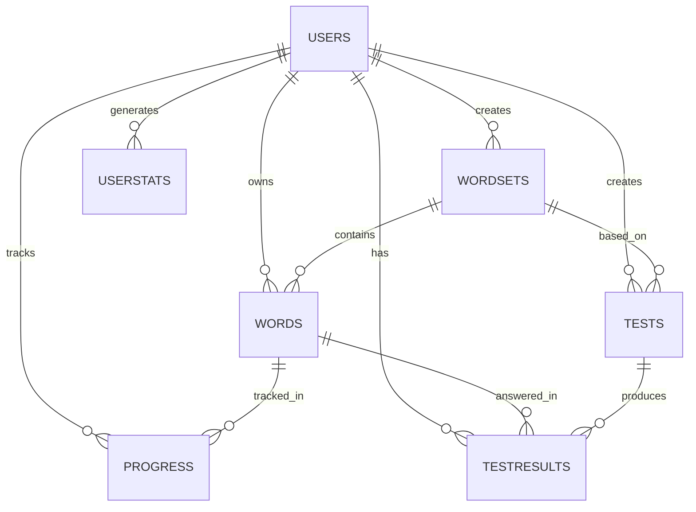

# 🗄️ MongoDB Database Schema Design

## Overview
Database được thiết kế cho hệ thống học tiếng Trung đa người dùng với các tính năng:
- Multi-user authentication
- Personal word sets management
- Custom tests creation
- Progress tracking với SRS
- Community features (sharing, leaderboard)
- Import/Export capabilities

---

## 📊 Collections Overview

```
┌─────────────┐
│    Users    │
└──────┬──────┘
       │
       ├───────────────┬──────────────┬────────────────┬──────────────┐
       │               │              │                │              │
   ┌───▼────┐    ┌────▼─────┐   ┌───▼─────┐    ┌────▼──────┐  ┌───▼──────┐
   │WordSets│    │ Progress │   │  Tests  │    │TestResults│  │UserStats │
   └───┬────┘    └────┬─────┘   └───┬─────┘    └───────────┘  └──────────┘
       │              │             │
   ┌───▼────┐         │             │
   │ Words  │◄────────┴─────────────┘
   └────────┘
```

---

## 1️⃣ Users Collection

### Schema
```javascript
{
  _id: ObjectId("507f1f77bcf86cd799439011"),
  
  // Authentication
  email: "user@example.com",
  password: "$2b$10$N9qo8uLOickgx2ZMRZoMye.IjKRTGRD3hFU8nF9C5H8vP1F0m8bG6", // bcrypt hash
  username: "learner123",
  
  // Profile
  displayName: "John Doe",
  avatar: "https://cdn.example.com/avatars/user123.jpg",
  bio: "Learning Chinese for travel",
  
  // Account Status
  isActive: true,
  isVerified: true,
  isPremium: false,
  role: "user", // "user", "premium", "admin"
  
  // Preferences
  preferences: {
    theme: "light", // "light", "dark", "auto"
    language: "vi", // "vi", "en", "zh"
    dailyGoal: 20, // words per day
    notifications: {
      email: true,
      push: true,
      reviewReminder: true,
      achievementAlert: true,
      weeklyReport: true
    },
    studySettings: {
      autoPlayAudio: true,
      showPinyin: true,
      showZhuyin: false,
      reviewMode: "srs", // "srs", "random", "sequential"
      cardSide: "traditional" // "traditional", "vietnamese", "pinyin"
    }
  },
  
  // Stats Summary (cached)
  stats: {
    totalWords: 350,
    totalWordSets: 8,
    totalTests: 15,
    studyStreak: 12,
    longestStreak: 25,
    level: "intermediate", // "beginner", "intermediate", "advanced"
    totalStudyTime: 1250, // minutes
    lastStudyDate: ISODate("2026-02-02T10:00:00Z")
  },
  
  // Gamification
  points: 1250,
  badges: [
    {
      badgeId: "first_word",
      earnedAt: ISODate("2026-01-15T10:00:00Z")
    },
    {
      badgeId: "week_streak",
      earnedAt: ISODate("2026-01-22T10:00:00Z")
    }
  ],
  achievements: [
    {
      achievementId: "learn_100_words",
      progress: 100,
      total: 100,
      completed: true,
      completedAt: ISODate("2026-01-28T10:00:00Z")
    }
  ],
  
  // Social
  following: [ObjectId("507f1f77bcf86cd799439012")],
  followers: [ObjectId("507f1f77bcf86cd799439013")],
  followersCount: 0,
  followingCount: 0,
  
  // Security
  passwordResetToken: null,
  passwordResetExpires: null,
  emailVerificationToken: null,
  lastPasswordChange: ISODate("2026-01-10T10:00:00Z"),
  
  // Timestamps
  createdAt: ISODate("2026-01-01T10:00:00Z"),
  updatedAt: ISODate("2026-02-02T10:00:00Z"),
  lastLogin: ISODate("2026-02-02T09:30:00Z"),
  
  // Premium
  premiumExpiry: null,
  subscriptionId: null
}
```

### Indexes
```javascript
db.users.createIndex({ email: 1 }, { unique: true })
db.users.createIndex({ username: 1 }, { unique: true })
db.users.createIndex({ createdAt: -1 })
db.users.createIndex({ "stats.level": 1, points: -1 }) // For leaderboard
db.users.createIndex({ isActive: 1, isVerified: 1 })
```

### Validation
```javascript
db.createCollection("users", {
  validator: {
    $jsonSchema: {
      bsonType: "object",
      required: ["email", "password", "username", "createdAt"],
      properties: {
        email: {
          bsonType: "string",
          pattern: "^[a-zA-Z0-9._%+-]+@[a-zA-Z0-9.-]+\\.[a-zA-Z]{2,}$"
        },
        username: {
          bsonType: "string",
          minLength: 3,
          maxLength: 30
        },
        password: {
          bsonType: "string",
          minLength: 60,
          maxLength: 60
        }
      }
    }
  }
})
```

---

## 2️⃣ WordSets Collection

### Schema
```javascript
{
  _id: ObjectId("60a1b2c3d4e5f6a7b8c9d0e1"),
  
  // Owner
  userId: ObjectId("507f1f77bcf86cd799439011"),
  
  // Basic Info
  name: "HSK Level 1",
  description: "Basic vocabulary for HSK Level 1 exam - 150 essential words",
  coverImage: "https://cdn.example.com/covers/hsk1.jpg",
  
  // Categorization
  category: "beginner", // "beginner", "intermediate", "advanced", "custom"
  subcategory: "exam-prep", // "exam-prep", "travel", "business", "daily", etc.
  tags: ["hsk", "beginner", "exam", "essential"],
  
  // Visibility & Sharing
  isPublic: true,
  isOfficial: false, // Official/curated sets
  allowClone: true,
  allowContribute: false, // Allow others to suggest words
  
  // Content
  wordCount: 150,
  language: "zh-TW", // "zh-TW" (Traditional), "zh-CN" (Simplified)
  difficulty: 1, // 1-10
  
  // Stats
  stats: {
    totalWords: 150,
    cloneCount: 45,
    viewCount: 1250,
    favoriteCount: 89,
    rating: {
      average: 4.5,
      count: 23
    },
    completionRate: 65 // % of users who mastered all words
  },
  
  // Learning Progress (for owner)
  progress: {
    masteredWords: 45,
    learningWords: 85,
    newWords: 20,
    averageMastery: 58,
    lastStudied: ISODate("2026-02-02T10:00:00Z")
  },
  
  // Source tracking (if cloned)
  source: {
    originalSetId: ObjectId("60a1b2c3d4e5f6a7b8c9d0e2"),
    originalAuthorId: ObjectId("507f1f77bcf86cd799439015"),
    clonedAt: ISODate("2026-01-15T10:00:00Z")
  },
  
  // Metadata
  author: {
    userId: ObjectId("507f1f77bcf86cd799439011"),
    username: "learner123",
    displayName: "John Doe"
  },
  
  // Timestamps
  createdAt: ISODate("2026-01-01T10:00:00Z"),
  updatedAt: ISODate("2026-02-02T10:00:00Z"),
  publishedAt: ISODate("2026-01-05T10:00:00Z")
}
```

### Indexes
```javascript
db.wordsets.createIndex({ userId: 1, createdAt: -1 })
db.wordsets.createIndex({ isPublic: 1, category: 1, "stats.rating.average": -1 })
db.wordsets.createIndex({ isPublic: 1, "stats.cloneCount": -1 }) // Popular sets
db.wordsets.createIndex({ tags: 1 })
db.wordsets.createIndex({ name: "text", description: "text", tags: "text" }) // Text search
db.wordsets.createIndex({ "source.originalSetId": 1 }) // Find all clones
```

### Sample Query - Get Popular Public Sets
```javascript
db.wordsets.find({
  isPublic: true,
  category: "beginner"
}).sort({
  "stats.cloneCount": -1,
  "stats.rating.average": -1
}).limit(10)
```

---

## 3️⃣ Words Collection

### Schema
```javascript
{
  _id: ObjectId("60a1b2c3d4e5f6a7b8c9d0f1"),
  
  // References
  wordSetId: ObjectId("60a1b2c3d4e5f6a7b8c9d0e1"),
  userId: ObjectId("507f1f77bcf86cd799439011"),
  
  // Chinese Characters
  traditional: "你好",
  simplified: "你好",
  
  // Pronunciation
  pinyin: "nǐ hǎo",
  pinyinNumbered: "ni3 hao3", // Alternative format
  zhuyin: "ㄋㄧˇ ㄏㄠˇ",
  
  // Translations
  vietnamese: "xin chào",
  english: "hello",
  
  // Additional Info
  partOfSpeech: "interjection", // noun, verb, adjective, etc.
  category: "greeting",
  difficulty: 1, // 1-10
  hskLevel: 1, // 1-6
  frequency: 9500, // Word frequency ranking
  
  // Examples
  examples: [
    {
      sentence: "你好嗎？",
      sentenceSimplified: "你好吗？",
      translation: "Bạn khỏe không?",
      englishTranslation: "How are you?",
      pinyin: "nǐ hǎo ma?",
      audio: "https://cdn.example.com/audio/nihao-ma.mp3"
    },
    {
      sentence: "你好！很高興見到你。",
      sentenceSimplified: "你好！很高兴见到你。",
      translation: "Xin chào! Rất vui được gặp bạn.",
      englishTranslation: "Hello! Nice to meet you.",
      pinyin: "nǐ hǎo! hěn gāo xìng jiàn dào nǐ."
    }
  ],
  
  // Multimedia
  audio: "https://cdn.example.com/audio/nihao.mp3",
  audioSource: "google-tts", // "google-tts", "azure-tts", "forvo", "user-upload"
  image: "https://cdn.example.com/images/hello.jpg",
  
  // User Notes
  notes: "Cách chào hỏi phổ biến nhất trong tiếng Trung",
  mnemonicHint: "Ni = you, Hao = good. You good = Hello!",
  personalExamples: [
    "你好，我叫阮文明 - Xin chào, tôi tên là Nguyễn Văn Minh"
  ],
  
  // Related Words
  synonyms: [
    {
      wordId: ObjectId("60a1b2c3d4e5f6a7b8c9d0f2"),
      traditional: "您好",
      vietnamese: "xin chào (lịch sự)"
    }
  ],
  antonyms: [
    {
      wordId: ObjectId("60a1b2c3d4e5f6a7b8c9d0f3"),
      traditional: "再見",
      vietnamese: "tạm biệt"
    }
  ],
  
  // Character Breakdown (for learning)
  characters: [
    {
      char: "你",
      pinyin: "nǐ",
      meaning: "you",
      radical: "亻",
      strokes: 7
    },
    {
      char: "好",
      pinyin: "hǎo",
      meaning: "good",
      radical: "女",
      strokes: 6
    }
  ],
  
  // Tags
  tags: ["greeting", "daily", "essential", "hsk1"],
  
  // Metadata
  order: 1, // Position in word set
  isArchived: false,
  
  // Timestamps
  createdAt: ISODate("2026-01-01T10:00:00Z"),
  updatedAt: ISODate("2026-02-02T10:00:00Z")
}
```

### Indexes
```javascript
db.words.createIndex({ wordSetId: 1, order: 1 })
db.words.createIndex({ userId: 1, wordSetId: 1 })
db.words.createIndex({ traditional: 1 })
db.words.createIndex({ simplified: 1 })
db.words.createIndex({ traditional: "text", pinyin: "text", vietnamese: "text", english: "text" })
db.words.createIndex({ hskLevel: 1 })
db.words.createIndex({ category: 1, difficulty: 1 })
```

### Sample Query - Search Words
```javascript
db.words.find({
  userId: ObjectId("507f1f77bcf86cd799439011"),
  $text: { $search: "hello greeting" },
  difficulty: { $lte: 3 }
})
```

---

## 4️⃣ Progress Collection

### Schema
```javascript
{
  _id: ObjectId("60a1b2c3d4e5f6a7b8c9d1a1"),
  
  // References
  userId: ObjectId("507f1f77bcf86cd799439011"),
  wordId: ObjectId("60a1b2c3d4e5f6a7b8c9d0f1"),
  wordSetId: ObjectId("60a1b2c3d4e5f6a7b8c9d0e1"),
  
  // Mastery Level
  masteryLevel: 75, // 0-100
  status: "learning", // "new", "learning", "reviewing", "mastered", "forgotten"
  
  // Review Stats
  reviewCount: 15,
  correctCount: 12,
  incorrectCount: 3,
  consecutiveCorrect: 3,
  consecutiveIncorrect: 0,
  
  // Spaced Repetition System (SRS)
  srs: {
    interval: 7, // Days until next review
    easeFactor: 2.5, // SM-2 algorithm
    repetitions: 5,
    lastInterval: 3,
    
    // Review schedule
    lastReviewed: ISODate("2026-02-02T10:00:00Z"),
    nextReview: ISODate("2026-02-09T10:00:00Z"),
    
    // Leitner box system (alternative)
    box: 3, // Box 1-5
    boxHistory: [1, 2, 2, 3, 3]
  },
  
  // Time Tracking
  totalTimeSpent: 180, // seconds
  averageResponseTime: 12, // seconds per review
  
  // Review History (last 10)
  reviewHistory: [
    {
      reviewedAt: ISODate("2026-02-02T10:00:00Z"),
      isCorrect: true,
      responseTime: 8,
      reviewType: "flashcard", // "flashcard", "quiz", "test"
      difficultyRated: 4 // 1 (hard) - 5 (easy)
    },
    {
      reviewedAt: ISODate("2026-01-30T10:00:00Z"),
      isCorrect: true,
      responseTime: 10,
      reviewType: "flashcard",
      difficultyRated: 3
    },
    {
      reviewedAt: ISODate("2026-01-27T10:00:00Z"),
      isCorrect: false,
      responseTime: 15,
      reviewType: "quiz",
      difficultyRated: 2
    }
  ],
  
  // Learning Stages
  stages: {
    firstSeen: ISODate("2026-01-20T10:00:00Z"),
    firstCorrect: ISODate("2026-01-21T10:00:00Z"),
    masteredAt: null // When reached 100% mastery
  },
  
  // Timestamps
  createdAt: ISODate("2026-01-20T10:00:00Z"),
  updatedAt: ISODate("2026-02-02T10:00:00Z")
}
```

### Indexes
```javascript
db.progress.createIndex({ userId: 1, wordSetId: 1 })
db.progress.createIndex({ userId: 1, wordId: 1 }, { unique: true })
db.progress.createIndex({ userId: 1, "srs.nextReview": 1 }) // Due words
db.progress.createIndex({ userId: 1, status: 1 })
db.progress.createIndex({ userId: 1, masteryLevel: -1 }) // Weak words
```

### Sample Query - Get Due Words for Review
```javascript
db.progress.find({
  userId: ObjectId("507f1f77bcf86cd799439011"),
  "srs.nextReview": { $lte: new Date() },
  status: { $in: ["learning", "reviewing"] }
}).sort({ "srs.nextReview": 1 }).limit(20)
```

---

## 5️⃣ Tests Collection

### Schema
```javascript
{
  _id: ObjectId("60a1b2c3d4e5f6a7b8c9d2b1"),
  
  // References
  userId: ObjectId("507f1f77bcf86cd799439011"),
  wordSetId: ObjectId("60a1b2c3d4e5f6a7b8c9d0e1"),
  
  // Basic Info
  name: "HSK 1 - Practice Test #1",
  description: "Test your knowledge of HSK Level 1 vocabulary",
  coverImage: "https://cdn.example.com/test-covers/hsk1.jpg",
  
  // Test Configuration
  type: "multiple-choice", // "flashcard", "multiple-choice", "writing", "listening", "mixed"
  category: "vocabulary-test",
  
  // Settings
  settings: {
    // Questions
    questionCount: 20,
    includeAllWords: false, // If false, randomly select questions
    wordSelection: "random", // "random", "weakest", "recent", "custom"
    customWordIds: [], // If wordSelection is "custom"
    
    // Question Types (for mixed tests)
    questionTypes: {
      multipleChoice: 10,
      fillInBlank: 5,
      matching: 5
    },
    
    // Time
    timeLimit: 600, // seconds (10 minutes)
    hasTimeLimit: true,
    
    // Scoring
    passingScore: 70, // percentage
    pointsPerQuestion: 5,
    
    // Display
    randomizeQuestions: true,
    randomizeOptions: true,
    showCorrectAnswers: true, // After submission
    showExplanations: true,
    allowReview: true, // Review before submit
    
    // Retakes
    maxAttempts: 0, // 0 = unlimited
    retakeCooldown: 0 // minutes between attempts
  },
  
  // Questions (Pre-generated or template)
  questions: [
    {
      id: "q1",
      type: "multiple-choice",
      wordId: ObjectId("60a1b2c3d4e5f6a7b8c9d0f1"),
      
      // Question content
      question: "What is the meaning of '你好'?",
      questionInChinese: "你好",
      questionType: "meaning", // "meaning", "pinyin", "character", "usage"
      
      // Options
      options: [
        {
          id: "a",
          text: "xin chào",
          isCorrect: true
        },
        {
          id: "b",
          text: "tạm biệt",
          isCorrect: false
        },
        {
          id: "c",
          text: "cảm ơn",
          isCorrect: false
        },
        {
          id: "d",
          text: "xin lỗi",
          isCorrect: false
        }
      ],
      
      // Additional info
      explanation: "你好 (nǐ hǎo) là cách chào hỏi phổ biến nhất",
      hint: "This is the most common greeting",
      points: 5,
      difficulty: 1
    },
    {
      id: "q2",
      type: "fill-in-blank",
      wordId: ObjectId("60a1b2c3d4e5f6a7b8c9d0f2"),
      
      question: "Fill in the pinyin for: 謝謝",
      correctAnswer: "xiè xie",
      alternativeAnswers: ["xie xie", "xiexie"],
      caseSensitive: false,
      
      explanation: "謝謝 nghĩa là 'cảm ơn'",
      points: 5,
      difficulty: 2
    }
  ],
  
  // Visibility
  isPublic: true,
  isOfficial: false,
  allowClone: true,
  
  // Stats
  stats: {
    totalAttempts: 125,
    averageScore: 78.5,
    passRate: 65, // percentage
    cloneCount: 15,
    rating: {
      average: 4.2,
      count: 34
    }
  },
  
  // Timestamps
  createdAt: ISODate("2026-01-10T10:00:00Z"),
  updatedAt: ISODate("2026-02-02T10:00:00Z"),
  publishedAt: ISODate("2026-01-12T10:00:00Z")
}
```

### Indexes
```javascript
db.tests.createIndex({ userId: 1, createdAt: -1 })
db.tests.createIndex({ wordSetId: 1 })
db.tests.createIndex({ isPublic: 1, "stats.rating.average": -1 })
db.tests.createIndex({ type: 1, category: 1 })
db.tests.createIndex({ name: "text", description: "text" })
```

---

## 6️⃣ TestResults Collection

### Schema
```javascript
{
  _id: ObjectId("60a1b2c3d4e5f6a7b8c9d3c1"),
  
  // References
  userId: ObjectId("507f1f77bcf86cd799439011"),
  testId: ObjectId("60a1b2c3d4e5f6a7b8c9d2b1"),
  wordSetId: ObjectId("60a1b2c3d4e5f6a7b8c9d0e1"),
  
  // Session Info
  sessionId: "session_abc123def456",
  attemptNumber: 1,
  
  // Scores
  score: 85, // percentage
  pointsEarned: 85,
  totalPoints: 100,
  
  // Results
  totalQuestions: 20,
  correctAnswers: 17,
  incorrectAnswers: 3,
  skippedAnswers: 0,
  
  // Time
  timeLimit: 600, // seconds
  timeSpent: 540, // seconds
  timeRemaining: 60,
  
  // Pass/Fail
  passed: true,
  passingScore: 70,
  
  // Detailed Answers
  answers: [
    {
      questionId: "q1",
      wordId: ObjectId("60a1b2c3d4e5f6a7b8c9d0f1"),
      userAnswer: "a",
      correctAnswer: "a",
      isCorrect: true,
      points: 5,
      timeSpent: 8,
      
      // Question snapshot
      question: {
        text: "What is the meaning of '你好'?",
        word: "你好",
        correctText: "xin chào"
      }
    },
    {
      questionId: "q2",
      wordId: ObjectId("60a1b2c3d4e5f6a7b8c9d0f2"),
      userAnswer: "xiè xie",
      correctAnswer: "xiè xie",
      isCorrect: true,
      points: 5,
      timeSpent: 12
    },
    {
      questionId: "q3",
      wordId: ObjectId("60a1b2c3d4e5f6a7b8c9d0f3"),
      userAnswer: "b",
      correctAnswer: "c",
      isCorrect: false,
      points: 0,
      timeSpent: 15
    }
  ],
  
  // Performance Analysis
  analysis: {
    strengths: ["greeting", "common-phrases"],
    weaknesses: ["numbers", "colors"],
    weakWordIds: [
      ObjectId("60a1b2c3d4e5f6a7b8c9d0f3"),
      ObjectId("60a1b2c3d4e5f6a7b8c9d0f5")
    ],
    averageTimePerQuestion: 27, // seconds
    accuracyByDifficulty: {
      1: 100, // Easy questions
      2: 85,  // Medium
      3: 60   // Hard
    }
  },
  
  // Rewards
  rewards: {
    pointsEarned: 85,
    badgesEarned: ["first_test_passed"],
    achievementsProgress: [
      {
        achievementId: "complete_10_tests",
        progress: 1,
        total: 10
      }
    ]
  },
  
  // Timestamps
  startedAt: ISODate("2026-02-02T10:00:00Z"),
  completedAt: ISODate("2026-02-02T10:09:00Z"),
  createdAt: ISODate("2026-02-02T10:09:00Z")
}
```

### Indexes
```javascript
db.testresults.createIndex({ userId: 1, completedAt: -1 })
db.testresults.createIndex({ testId: 1, score: -1 })
db.testresults.createIndex({ userId: 1, testId: 1, attemptNumber: 1 })
db.testresults.createIndex({ wordSetId: 1 })
db.testresults.createIndex({ passed: 1, score: -1 })
```

### Sample Query - Get User's Best Scores
```javascript
db.testresults.aggregate([
  { $match: { userId: ObjectId("507f1f77bcf86cd799439011") } },
  { $sort: { testId: 1, score: -1 } },
  { $group: {
    _id: "$testId",
    bestScore: { $first: "$score" },
    bestResult: { $first: "$$ROOT" }
  }}
])
```

---

## 7️⃣ UserStats Collection

### Schema
```javascript
{
  _id: ObjectId("60a1b2c3d4e5f6a7b8c9d4d1"),
  
  // Reference
  userId: ObjectId("507f1f77bcf86cd799439011"),
  
  // Date tracking
  date: ISODate("2026-02-02T00:00:00Z"), // Start of day UTC
  year: 2026,
  month: 2,
  week: 5, // Week number of year
  dayOfWeek: 2, // 0 = Sunday, 1 = Monday, etc.
  
  // Daily Stats
  daily: {
    // Learning
    wordsLearned: 5, // New words learned
    wordsReviewed: 25,
    wordsMastered: 3, // Reached 100% mastery
    
    // Practice
    flashcardsSeen: 30,
    flashcardsCorrect: 24,
    flashcardsIncorrect: 6,
    
    // Tests
    testsStarted: 2,
    testsCompleted: 2,
    testsPassed: 1,
    testsFailed: 1,
    averageTestScore: 75,
    
    // Time
    studyTime: 45, // minutes
    sessionCount: 3,
    averageSessionTime: 15, // minutes
    
    // Streak
    studyStreak: 12,
    isStudyDay: true,
    
    // Points & Rewards
    pointsEarned: 125,
    badgesEarned: [],
    achievementsCompleted: []
  },
  
  // Cumulative Stats
  cumulative: {
    totalWords: 150,
    totalWordSets: 5,
    totalTests: 15,
    totalStudyTime: 1250, // minutes
    totalPoints: 5420,
    currentLevel: "intermediate",
    
    // Progress
    masteredWords: 45,
    learningWords: 85,
    newWords: 20,
    
    // Performance
    overallAccuracy: 78, // percentage
    averageTestScore: 76
  },
  
  // Activity by hour (for heatmap)
  hourlyActivity: [
    { hour: 9, studyTime: 15, wordsReviewed: 10 },
    { hour: 14, studyTime: 20, wordsReviewed: 15 },
    { hour: 20, studyTime: 10, wordsReviewed: 5 }
  ],
  
  // Word Set Performance
  wordSetStats: [
    {
      wordSetId: ObjectId("60a1b2c3d4e5f6a7b8c9d0e1"),
      wordSetName: "HSK Level 1",
      wordsReviewed: 15,
      accuracy: 80,
      timeSpent: 25 // minutes
    }
  ],
  
  // Category Performance
  categoryStats: {
    "greeting": { accuracy: 95, timeSpent: 10 },
    "numbers": { accuracy: 65, timeSpent: 20 },
    "colors": { accuracy: 70, timeSpent: 15 }
  },
  
  // Timestamps
  createdAt: ISODate("2026-02-02T10:00:00Z"),
  updatedAt: ISODate("2026-02-02T20:30:00Z")
}
```

### Indexes
```javascript
db.userstats.createIndex({ userId: 1, date: -1 }, { unique: true })
db.userstats.createIndex({ userId: 1, year: 1, month: 1 })
db.userstats.createIndex({ userId: 1, year: 1, week: 1 })
db.userstats.createIndex({ date: -1 })
```

### Sample Query - Get Monthly Stats
```javascript
db.userstats.aggregate([
  {
    $match: {
      userId: ObjectId("507f1f77bcf86cd799439011"),
      year: 2026,
      month: 2
    }
  },
  {
    $group: {
      _id: null,
      totalWordsLearned: { $sum: "$daily.wordsLearned" },
      totalStudyTime: { $sum: "$daily.studyTime" },
      totalTestsCompleted: { $sum: "$daily.testsCompleted" },
      averageAccuracy: { $avg: "$daily.flashcardsCorrect" },
      studyDays: { $sum: { $cond: ["$daily.isStudyDay", 1, 0] } }
    }
  }
])
```

---

## 8️⃣ Additional Collections

### Badges Collection
```javascript
{
  _id: ObjectId("60a1b2c3d4e5f6a7b8c9d5e1"),
  badgeId: "first_word",
  name: "First Step",
  nameVi: "Bước Đầu Tiên",
  description: "Learn your first word",
  descriptionVi: "Học từ đầu tiên",
  icon: "https://cdn.example.com/badges/first-word.png",
  category: "milestone",
  rarity: "common", // "common", "rare", "epic", "legendary"
  points: 10
}
```

### Achievements Collection
```javascript
{
  _id: ObjectId("60a1b2c3d4e5f6a7b8c9d5e2"),
  achievementId: "learn_100_words",
  name: "Vocabulary Master",
  nameVi: "Bậc Thầy Từ Vựng",
  description: "Learn 100 words",
  descriptionVi: "Học 100 từ vựng",
  icon: "https://cdn.example.com/achievements/100-words.png",
  category: "learning",
  requirement: {
    type: "word_count",
    target: 100
  },
  reward: {
    points: 100,
    badge: "vocabulary_master"
  }
}
```

### Notifications Collection
```javascript
{
  _id: ObjectId("60a1b2c3d4e5f6a7b8c9d5e3"),
  userId: ObjectId("507f1f77bcf86cd799439011"),
  type: "review_reminder", // "review_reminder", "achievement", "social", "system"
  title: "Time to Review!",
  message: "You have 15 words due for review",
  data: {
    dueWordsCount: 15,
    wordSetId: ObjectId("60a1b2c3d4e5f6a7b8c9d0e1")
  },
  isRead: false,
  createdAt: ISODate("2026-02-02T10:00:00Z")
}
```

---

## 🔗 Relationships Diagram



---

## 📈 Sample Queries

### 1. Get User Dashboard Data
```javascript
// Aggregate user stats
db.users.aggregate([
  { $match: { _id: ObjectId("507f1f77bcf86cd799439011") } },
  {
    $lookup: {
      from: "wordsets",
      localField: "_id",
      foreignField: "userId",
      as: "wordSets"
    }
  },
  {
    $lookup: {
      from: "userstats",
      let: { userId: "$_id" },
      pipeline: [
        { $match: { $expr: { $eq: ["$userId", "$$userId"] } } },
        { $sort: { date: -1 } },
        { $limit: 7 }
      ],
      as: "recentStats"
    }
  },
  {
    $project: {
      profile: {
        displayName: 1,
        avatar: 1,
        stats: 1
      },
      totalWordSets: { $size: "$wordSets" },
      recentActivity: "$recentStats"
    }
  }
])
```

### 2. Get Leaderboard
```javascript
db.users.aggregate([
  { $match: { isActive: true } },
  { $sort: { points: -1, "stats.studyStreak": -1 } },
  { $limit: 100 },
  {
    $project: {
      rank: { $add: [{ $indexOfArray: ["$_id", "$_id"] }, 1] },
      username: 1,
      displayName: 1,
      avatar: 1,
      points: 1,
      level: "$stats.level",
      streak: "$stats.studyStreak"
    }
  }
])
```

### 3. Get Popular Word Sets
```javascript
db.wordsets.find({
  isPublic: true,
  wordCount: { $gte: 20 }
}).sort({
  "stats.cloneCount": -1,
  "stats.rating.average": -1
}).limit(20)
```

### 4. Get Words Due for Review Today
```javascript
db.progress.aggregate([
  {
    $match: {
      userId: ObjectId("507f1f77bcf86cd799439011"),
      "srs.nextReview": { $lte: new Date() }
    }
  },
  {
    $lookup: {
      from: "words",
      localField: "wordId",
      foreignField: "_id",
      as: "word"
    }
  },
  { $unwind: "$word" },
  { $sort: { "srs.nextReview": 1 } },
  { $limit: 50 }
])
```

---

## 🛡️ Data Integrity Rules

1. **Cascading Deletes**:
   - When WordSet deleted → Delete all Words in set
   - When User deleted → Archive or transfer WordSets
   - When Test deleted → Keep TestResults for history

2. **Referential Integrity**:
   - Always validate userId, wordSetId, wordId exists
   - Use MongoDB transactions for multi-document operations

3. **Data Consistency**:
   - Update cached stats (wordCount, masteredWords) via triggers/middleware
   - Maintain denormalized data (author info in WordSets)

---

## 🚀 Migration Script Example

```javascript
// Migrate from single-user to multi-user
async function migrateToMultiUser() {
  const defaultUserId = ObjectId("507f1f77bcf86cd799439011");
  
  // Create default user
  await db.users.insertOne({
    _id: defaultUserId,
    email: "admin@example.com",
    username: "admin",
    displayName: "Admin",
    createdAt: new Date()
  });
  
  // Create default word set
  const defaultWordSetId = ObjectId();
  await db.wordsets.insertOne({
    _id: defaultWordSetId,
    userId: defaultUserId,
    name: "My Vocabulary",
    description: "Migrated from old system",
    isPublic: false,
    createdAt: new Date()
  });
  
  // Update all existing words
  await db.words.updateMany(
    {},
    {
      $set: {
        userId: defaultUserId,
        wordSetId: defaultWordSetId
      }
    }
  );
  
  console.log("Migration completed!");
}
```

---

**Version**: 2.0.0  
**Last Updated**: 02/02/2026  
**Status**: Ready for Implementation
